# Modern ABAP

---

Which SAP NetWeaver Version do you use?

---

```abap
DATA lt_umsatz TYPE tt_umsatz OCCURS 10 WITH HEADER LINE.
DATA lv_gesamt_umsatz TYPE P LENGTH 16 DECIMALS 9.

LOOP AT lt_umsatz.
    
    ADD lt_umsatz-umsatz TO lv_gesamt_umsatz. 

ENDLOOP.
```

---


## Inline Declarations
Since NW 7.40

---

```abap
DATA lv_test TYPE i.
lv_test = 1.
```
instead

```abap
DATA(lv_test) = 1.
```

---

## Advantages:
- Less lines
- Fewer "declaration headers" in methods, thus avoid having unneeded variables around
- Type inference, so less problems when refactoring code

---

## Inline Declarations

```abap
obj->meth( 
	EXPORTING
		iv_value = 42
	IMPORTING 
		ev_result = DATA(lv_test) 
).
```

```abap
LOOP AT ... INTO DATA(ls_line).
```

```abap
LOOP AT ... ASSIGNING FIELD-SYMBOL(<ls_line>).
```

---

## String Templates

---

```abap
WRITE |Hello { sy-uname }|.
```

```abap
WRITE |Hello | && sy-uname.
```

---

## Constructor Expressions
Since NW 7.40

---

Classes and Type Conversion
```abap
NEW cl_meetup( CONV meetup_attendees( 11 ) )->get_topic( ).
NEW cl_meetup( CAST cl_my_object( cl_factory=>get( ) ) ).      " Nested™
```

Exceptions
```abap
RAISE EXCEPTION TYPE cx_exception
  MESSAGE ID 'MEETUP' 
  TYPE 'E' 
  NUMBER '11' 
  WITH 'Cologne'.

RAISE EXCEPTION NEW cx_exception_fancy( ).
```

---

Conditional Statements
```abap
DATA(lv_drink) = SWITCH meetup_drink( sy-daytime
	WHEN 'MORNING'
		THEN 'Milk Coffee'
	WHEN 'NOON'
		THEN 'Espresso'
	ELSE
		'Cacao'
).
```

```abap
DATA(lv_food) = COND meetup_food(
	WHEN sy-outside_temperature > 25
		THEN 'Ice Cream'
	ELSE
		'Sandwich'
).
```

---

Reference Statement

```abap
GET REFERENCE OF lt_pos_data INTO lr_pos_data.

lr_pos_data = REF #( lt_pos_data ).
```

---

Table Expressions

```abap
lt_top_products = FILTER #( lt_products WHERE turnover >= lc_cash_cow_turnover ).
```

```abap
IF NOT line_exists( lt_products[ name = 'Club Mate' ] ).
	me->buy_mate( ).
ELSE.
	lt_products[ name = 'Club Mate' ]->drink( )   "⚠ cx_sy_itab_line_not_found
ENDIF.
```

```abap
lt_abap_devs = FILTER #( lt_employees USING KEY skills WHERE
	abap_objects = abap_true 
	hana = abap_true 
).
```

---

FOR Expression

```abap
lt_product_range = VALUE #( FOR lt_products IN <ls_> ( 
	sign = 'I'
	option = 'EQ' 
	low = <ls_>-matnr 
) ).
```

---

xsdbool

```abap
DATA(lv_editable) = xsdbool( sy-ucomm = 'EDIT')
```

---

### Increment and decrement variables
Since NW 7.54

```abap
lv_var += 1
lv_var -= 1
```

---

## ABAP SQL
> formerly open SQL

---

```abap
SELECT
  uuid( ) as guid,			" 7.54
  matnr,  					" 7.40 SP05
  maktx,
  'X' as translated   		" 7.50
FROM
  makt
CROSS JOIN					" 7.51
  @lt_whatever as lt_ 		" 7.52
WHERE
  spras = 'D' AND
  maktx IS NOT INITIAL		" 7.53
INTO TABLE
  @DATA(lt_). 				" 7.40 SP08
```

- uuid( ) counterpart for HANA SYSUUID function

---

## Which IDE do you use?

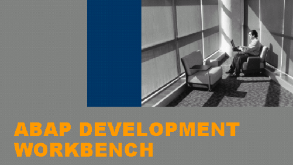


---

# ABAP Development Tools (ADT) 
> formerly ABAP in Eclipse (AiE)

---

### ABAP Development Tools
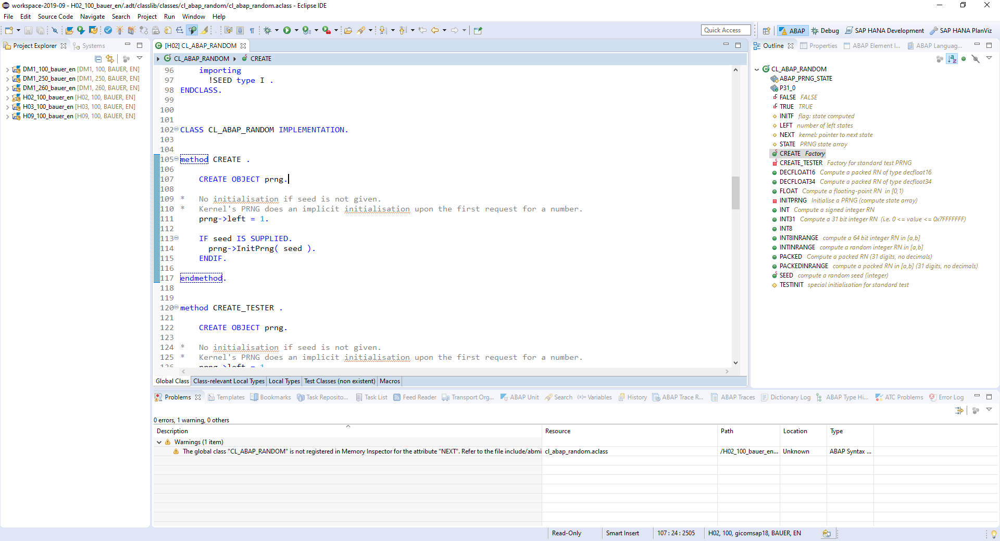


---

### Search Development Objects

CTRL + SHIFT + A

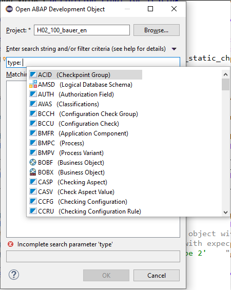
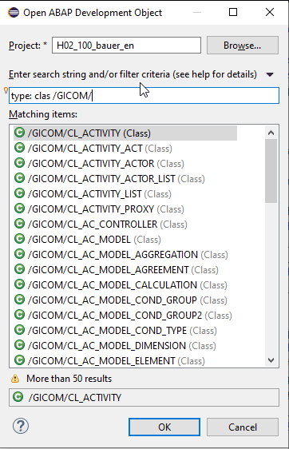
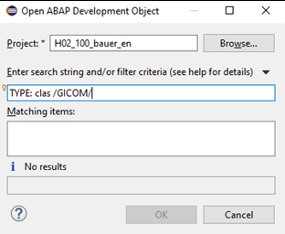

---

### F9: Run Report in Console
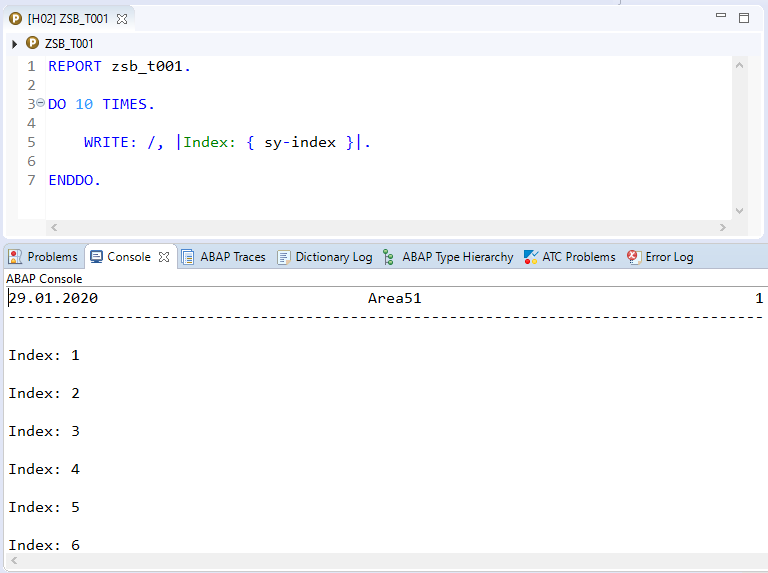
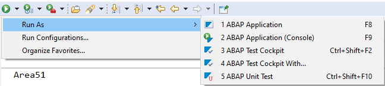

---

### Debug Settings
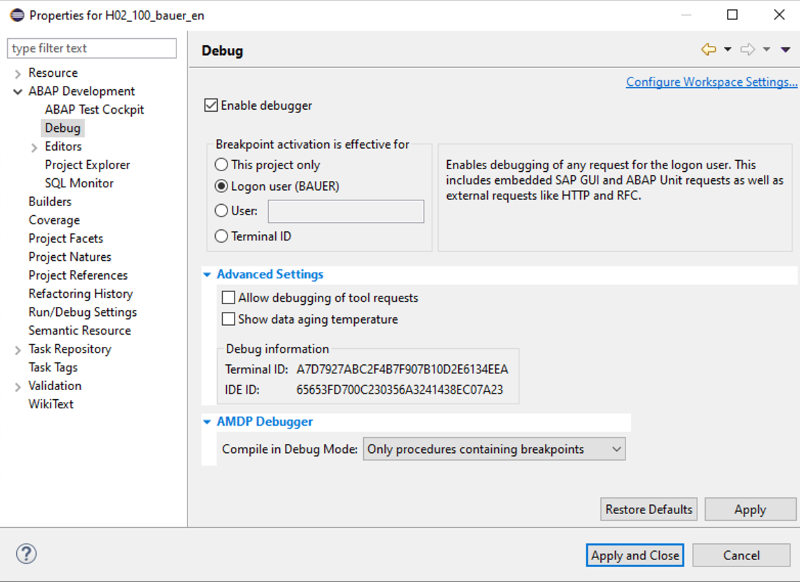

---

### ABAP Formatter
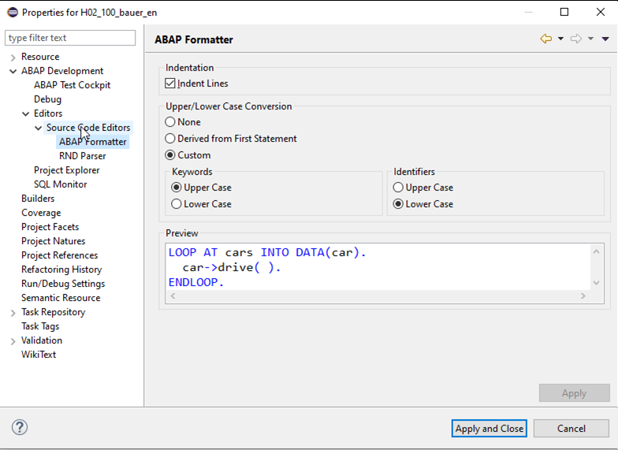
---

### Code Completion
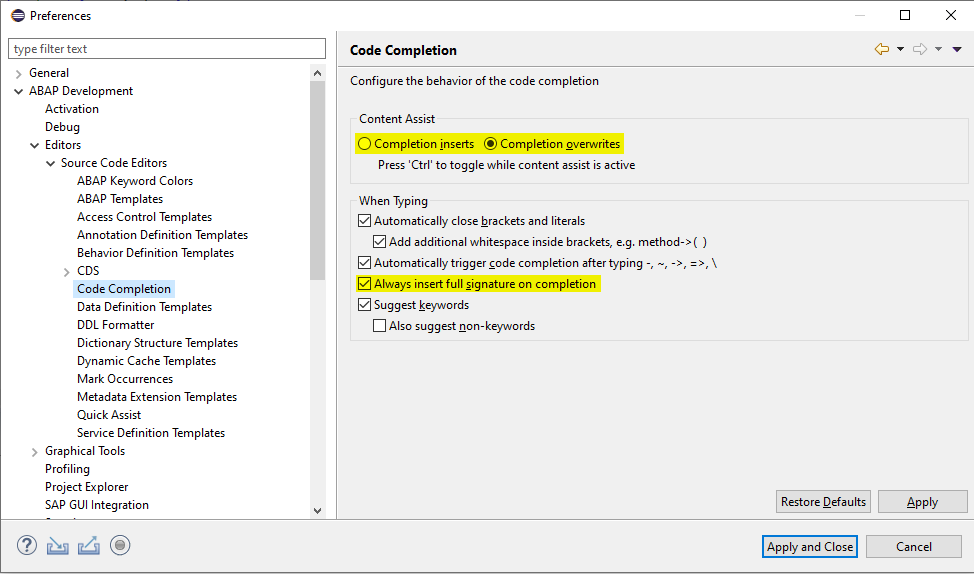

---

### SAP GUI Integration
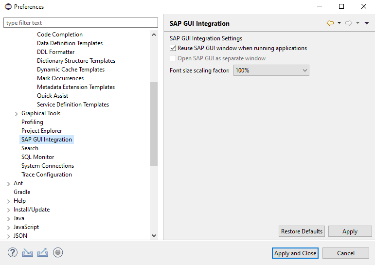

---

### Search
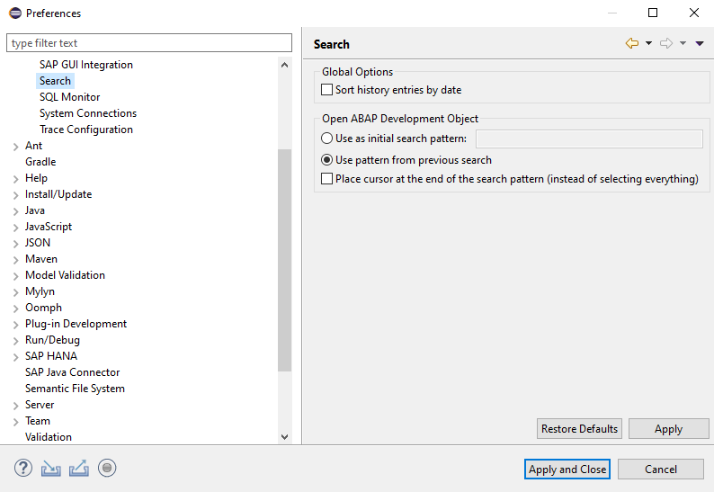
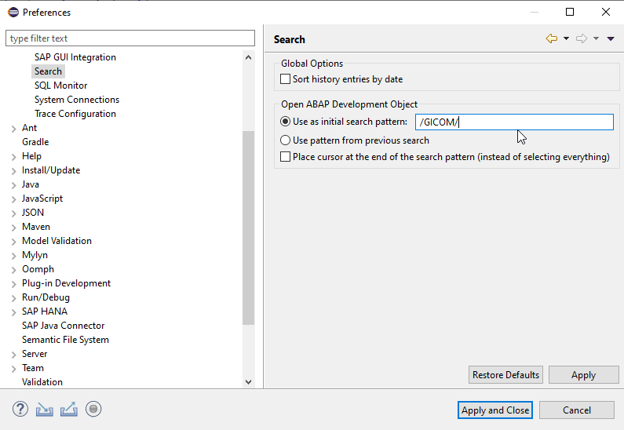

---

### Navigate to Eclipse from SAP GUI

CTRL + 6

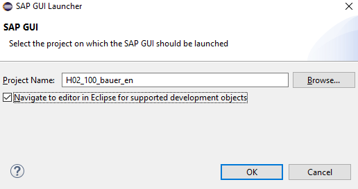

---

### Text Pool

CTRL + 1

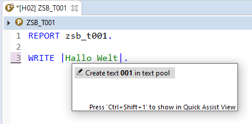

---

### Enhancements

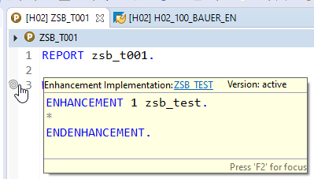

---

# Outlook

---

## Code Push Down

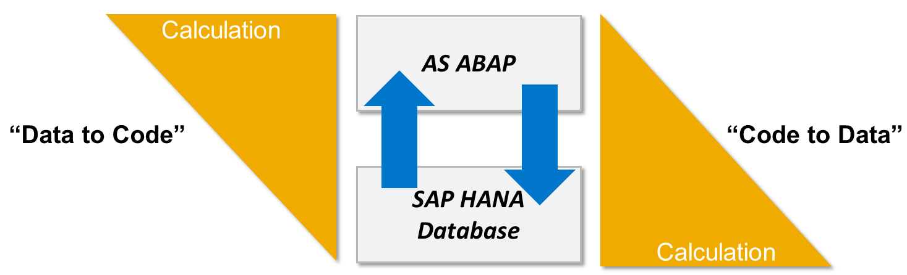
<sub><sub><sub><sub><sub>https://blogs.sap.com/2014/02/03/abap-for-hana-code-push-down/</sub></sub></sub></sub></sub>

---
### Code Push Down
- CDS Views
- ABAP Managed Database Procedures (AMDP)s

---

### CDS Views

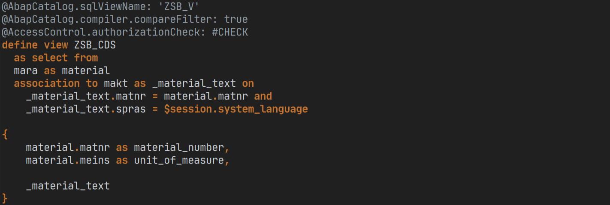

---

### CDS Path Expressions

```abap
SELECT 
    material_number,
    unit_of_measure,
    \_material_text-maktx 
FROM 
    zsb_cds 
INTO TABLE
    @DATA(lt_).
```

---

### AMDP

```abap
CLASS zsb_cl_amdp_test DEFINITION
  PUBLIC
  FINAL
  CREATE PUBLIC .

  PUBLIC SECTION.
    INTERFACES if_amdp_marker_hdb.
    
    TYPES: tt_mara TYPE STANDARD TABLE OF mara.

    CLASS-METHODS: read_product
      IMPORTING
        VALUE(iv_matnr)    TYPE mara-matnr
      EXPORTING
        VALUE(et_material) TYPE tt_mara
      RAISING
        cx_amdp_error .

ENDCLASS.


CLASS ZSB_CL_AMDP_TEST IMPLEMENTATION.


  METHOD read_product BY DATABASE PROCEDURE
    FOR HDB LANGUAGE SQLSCRIPT
    OPTIONS READ-ONLY
    USING mara.

    et_material = select mat.*
        FROM "MARA" as mat
        WHERE matnr = :iv_matnr;

  ENDMETHOD.

ENDCLASS.
```

---

### RESTful ABAP Programming Model (RAP)
- Development of applications based on CDS views
- Successor of BOPF, but with less code generation
- Automatic creation of SAPUI5 application possible (at runtime)
- Importing for ABAP Cloud

---

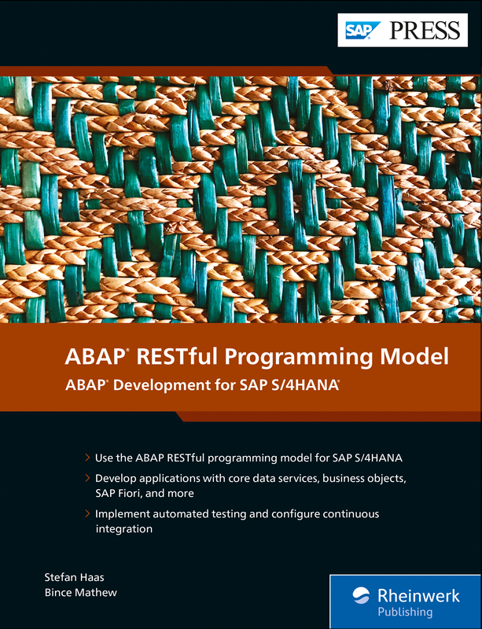

---

<section data-background="#fff">


